# 📋 Informe de Funcionalidades - Sistema Inmobiliario

**Proyecto:** Frontend Inmobiliaria con Next.js  
**Backend:** NestJS REST API  
**Fecha:** Noviembre 2025  
**Curso:** Computación en Internet III

---

## 📑 Tabla de Contenidos

1. [Introducción](#1-introducción)
2. [Arquitectura del Sistema](#2-arquitectura-del-sistema)
3. [Autenticación (JWT)](#3-autenticación-jwt)
4. [Autorización (RBAC)](#4-autorización-rbac)
5. [Gestión del Estado](#5-gestión-del-estado)
6. [Funcionalidades Implementadas](#6-funcionalidades-implementadas)
7. [Decisiones Técnicas](#7-decisiones-técnicas)
8. [Conclusiones](#8-conclusiones)

---

## 1. Introducción

### 1.1 Descripción de la Aplicación

Sistema de gestión inmobiliaria que permite a agentes y administradores gestionar propiedades, usuarios y tareas relacionadas con el proceso de venta/alquiler de inmuebles. La aplicación cuenta con un sistema robusto de autenticación y autorización basado en roles.

### 1.2 Tecnologías Utilizadas

#### **Frontend:**

- **Next.js 16.0.1** - Framework React con App Router y Server Components
- **React 19.2.0** - Biblioteca para construcción de interfaces
- **TypeScript 5.x** - Tipado estático para JavaScript
- **Tailwind CSS 4** - Framework de utilidades CSS
- **Lucide React** - Biblioteca de íconos
- **Context API** - Gestión de estado global

#### **Backend (Consumido):**

- **NestJS** - Framework Node.js para APIs REST
- **PostgreSQL** - Base de datos relacional
- **JWT** - Tokens de autenticación
- **Bcrypt** - Encriptación de contraseñas

### 1.3 Objetivos del Proyecto

1. ✅ Implementar sistema de autenticación seguro con JWT
2. ✅ Establecer control de acceso basado en roles (RBAC)
3. ✅ Desarrollar interfaz de usuario intuitiva y responsive
4. ✅ Gestionar estado de la aplicación de manera centralizada
5. ✅ Implementar CRUD completo para 3 entidades (Users, Properties, Tasks)
6. ✅ Consumir API REST del backend NestJS
7. ✅ Validar formularios sin usar `window.alert()`
8. ✅ Optimizar experiencia de usuario con loading states

---

## 2. Arquitectura del Sistema

### 2.1 Diagrama de Arquitectura

```
┌─────────────────────────────────────────────────────────────┐
│                      NEXT.JS APP ROUTER                      │
├─────────────────────────────────────────────────────────────┤
│                                                               │
│  ┌──────────────┐  ┌──────────────┐  ┌──────────────┐      │
│  │   Public     │  │     Auth     │  │  Protected   │      │
│  │   Routes     │  │   Routes     │  │   Routes     │      │
│  │              │  │              │  │              │      │
│  │ • Landing    │  │ • Login      │  │ • Dashboard  │      │
│  │ • Catalog    │  │ • Register   │  │ • Profile    │      │
│  │ • Detail     │  │              │  │ • Users      │      │
│  │              │  │              │  │ • Properties │      │
│  │              │  │              │  │ • Tasks      │      │
│  └──────────────┘  └──────────────┘  └──────────────┘      │
│         │                  │                  │              │
│         └──────────────────┴──────────────────┘              │
│                            │                                 │
│                     ┌──────▼──────┐                         │
│                     │ AuthContext │ (Context API)           │
│                     │  + Hooks    │                         │
│                     └──────┬──────┘                         │
│                            │                                 │
│          ┌─────────────────┼─────────────────┐              │
│          │                 │                 │              │
│   ┌──────▼──────┐  ┌──────▼──────┐  ┌──────▼──────┐       │
│   │   Auth      │  │   Users     │  │ Properties  │       │
│   │  Feature    │  │  Feature    │  │   Feature   │       │
│   │             │  │             │  │             │       │
│   │ • Services  │  │ • Services  │  │ • Services  │       │
│   │ • Hooks     │  │ • Hooks     │  │ • Hooks     │       │
│   │ • Types     │  │ • Types     │  │ • Types     │       │
│   │ • Components│  │ • Components│  │ • Components│       │
│   └─────────────┘  └─────────────┘  └─────────────┘       │
│          │                 │                 │              │
│          └─────────────────┴─────────────────┘              │
│                            │                                 │
│                     ┌──────▼──────┐                         │
│                     │  API Client │                         │
│                     │  (Axios-like)│                        │
│                     └──────┬──────┘                         │
└────────────────────────────┼────────────────────────────────┘
                             │
                    ┌────────▼────────┐
                    │   NestJS API    │
                    │   Backend       │
                    │                 │
                    │ • Auth          │
                    │ • Users         │
                    │ • Properties    │
                    │ • Tasks         │
                    └────────┬────────┘
                             │
                    ┌────────▼────────┐
                    │   PostgreSQL    │
                    │   Database      │
                    └─────────────────┘
```

### 2.2 Estructura de Carpetas

```
src/
├── app/                          # Pages (App Router)
│   ├── page.tsx                  # Landing page pública
│   ├── layout.tsx                # Root layout
│   ├── globals.css               # Estilos globales
│   │
│   ├── auth/                     # Rutas de autenticación
│   │   ├── login/page.tsx        # Página de inicio de sesión
│   │   └── register/page.tsx     # Página de registro
│   │
│   ├── catalog/                  # Catálogo público
│   │   ├── page.tsx              # Lista de propiedades (público)
│   │   └── [id]/page.tsx         # Detalle de propiedad (público)
│   │
│   └── (protected)/              # Layout protegido
│       ├── layout.tsx            # Layout con autenticación requerida
│       ├── dashboard/
│       │   ├── page.tsx          # Dashboard principal
│       │   └── tasks/
│       │       ├── page.tsx      # Lista de tareas
│       │       ├── create/page.tsx
│       │       └── [id]/page.tsx
│       ├── profile/page.tsx      # Perfil del usuario
│       ├── users/                # Gestión de usuarios (admin)
│       │   ├── page.tsx
│       │   ├── create/page.tsx
│       │   └── [id]/page.tsx
│       └── properties/           # Gestión de propiedades
│           ├── page.tsx
│           ├── create/page.tsx
│           └── [id]/page.tsx
│
├── features/                     # Módulos por dominio
│   ├── auth/                     # Módulo de autenticación
│   │   ├── components/
│   │   │   ├── LoginForm.tsx
│   │   │   └── RegisterForm.tsx
│   │   ├── context/
│   │   │   └── AuthContext.tsx   # Estado global de autenticación
│   │   ├── hooks/
│   │   │   ├── useAuth.ts        # Hook para acceder al contexto
│   │   │   └── useRequireAuth.ts # HOC para proteger rutas
│   │   ├── services/
│   │   │   └── authService.ts    # Lógica de API
│   │   └── types/
│   │       └── index.ts          # TypeScript types
│   │
│   ├── users/                    # Módulo de usuarios
│   │   ├── hooks/
│   │   │   ├── useUsers.ts       # Lista + delete
│   │   │   ├── useUserForm.ts    # Crear/editar
│   │   │   ├── useUserDetail.ts  # Detalle individual
│   │   │   └── useProfile.ts     # Perfil propio
│   │   ├── services/
│   │   │   └── userService.ts
│   │   └── types/
│   │       └── index.ts
│   │
│   ├── properties/               # Módulo de propiedades
│   │   ├── components/
│   │   │   ├── PropertyCard.tsx
│   │   │   └── PropertyForm.tsx
│   │   ├── hooks/
│   │   │   ├── useProperties.ts         # Lista pública
│   │   │   ├── useAgentProperties.ts    # Lista del agente
│   │   │   ├── useAdminProperties.ts    # Lista admin
│   │   │   └── usePropertyDetail.ts     # Detalle individual
│   │   ├── services/
│   │   │   └── propertyService.ts
│   │   └── types/
│   │       └── index.ts
│   │
│   └── tasks/                    # Módulo de tareas
│       ├── components/
│       │   ├── TaskCard.tsx
│       │   ├── TaskForm.tsx
│       │   └── TaskList.tsx
│       ├── hooks/
│       │   ├── useAgentTasks.ts
│       │   ├── useAdminTasks.ts
│       │   ├── useAgentTaskDetail.ts
│       │   ├── useAdminTaskDetail.ts
│       │   └── useAgentTasksByProperty.ts
│       ├── services/
│       │   └── taskService.ts
│       └── types/
│           └── index.ts
│
├── shared/                       # Código compartido
│   ├── components/
│   │   └── ui/                   # Componentes UI reutilizables
│   │       ├── Button.tsx
│   │       ├── Input.tsx
│   │       ├── Card.tsx
│   │       ├── Table.tsx
│   │       └── Badge.tsx
│   ├── lib/
│   │   ├── apiClient.ts          # Cliente HTTP
│   │   └── authStorage.ts        # Gestión de tokens
│   └── types/
│       └── common.ts             # Tipos compartidos
│
└── components/                   # Componentes globales
    ├── Navbar.tsx                # Barra de navegación
    └── Footer.tsx                # Pie de página
```

### 2.3 Patrones de Diseño Implementados

#### **2.3.1 Feature-Based Architecture**

Cada módulo (auth, users, properties, tasks) contiene toda su lógica:

- **Components:** UI específica del módulo
- **Hooks:** Lógica de negocio y estado
- **Services:** Comunicación con API
- **Types:** Definiciones TypeScript

**Ventajas:**

- ✅ Código organizado y mantenible
- ✅ Fácil de escalar (agregar nuevos módulos)
- ✅ Separación clara de responsabilidades
- ✅ Reutilización de código

#### **2.3.2 Custom Hooks Pattern**

Cada operación tiene su propio hook:

```typescript
// Ejemplo: useUsers.ts
export function useUsers() {
  const [users, setUsers] = useState<User[]>([]);
  const [isLoading, setIsLoading] = useState(true);
  const [error, setError] = useState<string | null>(null);

  const fetchUsers = async () => {
    try {
      setIsLoading(true);
      const data = await userService.getAll();
      setUsers(data.users);
    } catch (err) {
      setError(err.message);
    } finally {
      setIsLoading(false);
    }
  };

  useEffect(() => {
    fetchUsers();
  }, []);

  const deleteUser = async (id: string) => {
    await userService.delete(id);
    await fetchUsers(); // Refetch después de eliminar
  };

  return { users, isLoading, error, deleteUser, refetch: fetchUsers };
}
```

**Ventajas:**

- ✅ Lógica reutilizable
- ✅ Estado encapsulado
- ✅ Fácil testing
- ✅ Componentes más limpios

#### **2.3.3 Service Layer Pattern**

Capa de servicios para comunicación con API:

```typescript
// Ejemplo: userService.ts
export const userService = {
  async getAll(): Promise<UserListResponseDto> {
    return apiClient.get<UserListResponseDto>("/users");
  },

  async create(data: CreateUserDto): Promise<UserResponseDto> {
    return apiClient.post<UserResponseDto>("/users", data);
  },

  async update(id: string, data: UpdateUserDto): Promise<UserResponseDto> {
    return apiClient.put<UserResponseDto>(`/users/${id}`, data);
  },

  async delete(id: string): Promise<void> {
    return apiClient.delete(`/users/${id}`);
  },
};
```

**Ventajas:**

- ✅ Centralización de llamadas API
- ✅ Fácil mockeo en tests
- ✅ Tipado fuerte con TypeScript
- ✅ Manejo consistente de errores

#### **2.3.4 Protected Routes Pattern**

Hook para proteger rutas automáticamente:

```typescript
// Ejemplo de uso
export default function ProtectedPage() {
  useRequireAuth(); // Redirige a /auth/login si no está autenticado

  return <div>Contenido protegido</div>;
}
```

---

## 3. Autenticación (JWT)

### 3.1 Flujo de Autenticación

```
┌─────────────┐
│   Usuario   │
└──────┬──────┘
       │
       │ 1. Ingresa credenciales
       ▼
┌─────────────────┐
│  LoginForm.tsx  │
└────────┬────────┘
         │
         │ 2. onSubmit()
         ▼
┌──────────────────────┐
│  authService.login() │
└──────────┬───────────┘
           │
           │ 3. POST /api/auth/login
           ▼
┌────────────────────┐
│    NestJS API      │
│  - Valida usuario  │
│  - Genera JWT      │
└──────────┬─────────┘
           │
           │ 4. Respuesta: { token, user }
           ▼
┌─────────────────────┐
│  AuthContext        │
│  - Guarda token en  │
│    localStorage     │
│  - Actualiza estado │
│  - setUser(user)    │
└──────────┬──────────┘
           │
           │ 5. Router.push('/dashboard')
           ▼
┌─────────────────────┐
│  Dashboard Page     │
│  (Protegida)        │
└─────────────────────┘
```

### 3.2 Implementación del AuthContext

```typescript
// src/features/auth/context/AuthContext.tsx
import { createContext, useState, useEffect, ReactNode } from "react";
import type { User } from "../types";
import { authStorage } from "@/shared/lib/authStorage";

interface AuthContextType {
  user: User | null;
  login: (token: string, user: User) => void;
  logout: () => void;
  isLoading: boolean;
}

export const AuthContext = createContext<AuthContextType | undefined>(
  undefined
);

export function AuthProvider({ children }: { children: ReactNode }) {
  const [user, setUser] = useState<User | null>(null);
  const [isLoading, setIsLoading] = useState(true);

  // Restaurar sesión al cargar la página
  useEffect(() => {
    const token = authStorage.getToken();
    const savedUser = authStorage.getUser();

    if (token && savedUser) {
      setUser(savedUser);
    }

    setIsLoading(false);
  }, []);

  const login = (token: string, user: User) => {
    authStorage.saveToken(token);
    authStorage.saveUser(user);
    setUser(user);
  };

  const logout = () => {
    authStorage.removeToken();
    authStorage.removeUser();
    setUser(null);
  };

  return (
    <AuthContext.Provider value={{ user, login, logout, isLoading }}>
      {children}
    </AuthContext.Provider>
  );
}
```

### 3.3 Hook useAuth

```typescript
// src/features/auth/hooks/useAuth.ts
import { useContext } from "react";
import { AuthContext } from "../context/AuthContext";

export function useAuth() {
  const context = useContext(AuthContext);

  if (!context) {
    throw new Error("useAuth debe usarse dentro de AuthProvider");
  }

  return context;
}
```

### 3.4 Gestión de Tokens

```typescript
// src/shared/lib/authStorage.ts
const TOKEN_KEY = "auth_token";
const USER_KEY = "auth_user";

export const authStorage = {
  saveToken(token: string): void {
    if (typeof window !== "undefined") {
      localStorage.setItem(TOKEN_KEY, token);
    }
  },

  getToken(): string | null {
    if (typeof window !== "undefined") {
      return localStorage.getItem(TOKEN_KEY);
    }
    return null;
  },

  removeToken(): void {
    if (typeof window !== "undefined") {
      localStorage.removeItem(TOKEN_KEY);
    }
  },

  saveUser(user: User): void {
    if (typeof window !== "undefined") {
      localStorage.setItem(USER_KEY, JSON.stringify(user));
    }
  },

  getUser(): User | null {
    if (typeof window !== "undefined") {
      const userStr = localStorage.getItem(USER_KEY);
      return userStr ? JSON.parse(userStr) : null;
    }
    return null;
  },

  removeUser(): void {
    if (typeof window !== "undefined") {
      localStorage.removeItem(USER_KEY);
    }
  },
};
```

### 3.5 Cliente API con Interceptores

```typescript
// src/shared/lib/apiClient.ts
import { authStorage } from "./authStorage";

const API_URL = process.env.NEXT_PUBLIC_API_URL || "http://localhost:3001/api";

class ApiClient {
  private async request<T>(
    endpoint: string,
    options: RequestInit = {}
  ): Promise<T> {
    const token = authStorage.getToken();

    const headers: HeadersInit = {
      "Content-Type": "application/json",
      ...(token && { Authorization: `Bearer ${token}` }), // Inyectar token
      ...options.headers,
    };

    const response = await fetch(`${API_URL}${endpoint}`, {
      ...options,
      headers,
    });

    if (!response.ok) {
      // Manejo de errores 401 (no autorizado)
      if (response.status === 401) {
        authStorage.removeToken();
        authStorage.removeUser();
        window.location.href = "/auth/login";
      }

      const error = await response.json();
      throw new Error(error.message || "Error en la petición");
    }

    if (response.status === 204) {
      return {} as T; // No content
    }

    return response.json();
  }

  async get<T>(endpoint: string): Promise<T> {
    return this.request<T>(endpoint, { method: "GET" });
  }

  async post<T>(endpoint: string, data: unknown): Promise<T> {
    return this.request<T>(endpoint, {
      method: "POST",
      body: JSON.stringify(data),
    });
  }

  async put<T>(endpoint: string, data: unknown): Promise<T> {
    return this.request<T>(endpoint, {
      method: "PUT",
      body: JSON.stringify(data),
    });
  }

  async delete<T>(endpoint: string): Promise<T> {
    return this.request<T>(endpoint, { method: "DELETE" });
  }
}

export const apiClient = new ApiClient();
```

### 3.6 Protección de Rutas

```typescript
// src/features/auth/hooks/useRequireAuth.ts
"use client";

import { useEffect } from "react";
import { useRouter } from "next/navigation";
import { useAuth } from "./useAuth";

export function useRequireAuth() {
  const { user, isLoading } = useAuth();
  const router = useRouter();

  useEffect(() => {
    if (!isLoading && !user) {
      // Redirigir a login si no está autenticado
      router.push("/auth/login");
    }
  }, [user, isLoading, router]);

  return { user, isLoading };
}
```

**Uso en páginas protegidas:**

```typescript
// src/app/(protected)/dashboard/page.tsx
"use client";

import { useRequireAuth } from "@/features/auth/hooks";

export default function DashboardPage() {
  const { user, isLoading } = useRequireAuth();

  if (isLoading) return <div>Cargando...</div>;
  if (!user) return null; // Se redirige automáticamente

  return (
    <div>
      <h1>Bienvenido, {user.name}</h1>
    </div>
  );
}
```

### 3.7 Flujo de Registro

```
┌─────────────┐
│   Usuario   │
└──────┬──────┘
       │
       │ 1. Completa formulario
       ▼
┌──────────────────┐
│ RegisterForm.tsx │
└────────┬─────────┘
         │
         │ 2. onSubmit()
         ▼
┌────────────────────────┐
│ authService.register() │
└──────────┬─────────────┘
           │
           │ 3. POST /api/auth/register
           ▼
┌────────────────────┐
│    NestJS API      │
│  - Crea usuario    │
│  - Genera JWT      │
└──────────┬─────────┘
           │
           │ 4. Respuesta: { token, user }
           ▼
┌─────────────────────┐
│  AuthContext.login()│
└──────────┬──────────┘
           │
           │ 5. Router.push('/dashboard')
           ▼
┌─────────────────────┐
│  Dashboard Page     │
└─────────────────────┘
```

### 3.8 Características de Seguridad

#### **3.8.1 Almacenamiento Seguro**

- ✅ Tokens en `localStorage` (solo cliente)
- ✅ No se exponen en el código fuente
- ✅ Limpieza automática en logout
- ✅ Validación de expiración en backend

#### **3.8.2 Manejo de Sesiones**

- ✅ Persistencia de sesión entre recargas
- ✅ Auto-login si existe token válido
- ✅ Redirección automática en token expirado (401)
- ✅ Limpieza de datos sensibles en logout

#### **3.8.3 Validaciones**

- ✅ Validación de campos en formularios
- ✅ Mensajes de error claros sin `window.alert()`
- ✅ Estados de carga durante autenticación
- ✅ Deshabilitación de botones durante submit

---

## 4. Autorización (RBAC)

### 4.1 Roles Implementados

El sistema cuenta con **2 roles principales:**

| Rol              | Descripción               | Permisos                                                                                                                                                                                             |
| ---------------- | ------------------------- | ---------------------------------------------------------------------------------------------------------------------------------------------------------------------------------------------------- |
| **`agent`**      | Agente inmobiliario       | • Ver/editar sus propias propiedades<br>• Ver/editar sus propias tareas<br>• Ver/editar su perfil<br>• **NO** puede gestionar usuarios                                                               |
| **`superadmin`** | Administrador del sistema | • Acceso completo a usuarios (CRUD)<br>• Acceso completo a propiedades (CRUD)<br>• Acceso completo a tareas (CRUD)<br>• Puede asignar tareas a cualquier agente<br>• Puede ver estadísticas globales |

### 4.2 Implementación de Permisos

#### **4.2.1 Endpoints Diferenciados por Rol**

El backend NestJS expone endpoints específicos para cada rol:

**Propiedades:**

```
Agent:
  GET    /api/properties/agent          # Solo sus propiedades
  POST   /api/properties/agent          # Crear (owner automático)
  GET    /api/properties/agent/:id      # Solo si es owner
  PUT    /api/properties/agent/:id      # Solo si es owner
  DELETE /api/properties/agent/:id      # Solo si es owner

Superadmin:
  GET    /api/properties/admin          # Todas las propiedades
  POST   /api/properties/admin          # Crear con ownerId manual
  GET    /api/properties/admin/:id      # Cualquier propiedad
  PUT    /api/properties/admin/:id      # Cualquier propiedad
  DELETE /api/properties/admin/:id      # Cualquier propiedad
```

**Tareas:**

```
Agent:
  GET    /api/tasks/agent               # Solo tareas asignadas a él
  POST   /api/tasks/agent               # Crear tarea
  GET    /api/tasks/agent/:id           # Solo si está asignada a él
  PUT    /api/tasks/agent/:id           # Solo si está asignada a él
  DELETE /api/tasks/agent/:id           # Solo si está asignada a él

Superadmin:
  GET    /api/tasks/admin               # Todas las tareas
  POST   /api/tasks/admin               # Crear con assignedToId manual
  GET    /api/tasks/admin/:id           # Cualquier tarea
  PUT    /api/tasks/admin/:id           # Cualquier tarea
  DELETE /api/tasks/admin/:id           # Cualquier tarea
```

#### **4.2.2 Servicios con Lógica de Rol**

```typescript
// src/features/properties/services/propertyService.ts
export const propertyService = {
  // AGENT: Solo sus propiedades
  async getForAgent(): Promise<PropertyListResponseDto> {
    return apiClient.get<PropertyListResponseDto>("/properties/agent");
  },

  async createForAgent(
    data: CreatePropertyByAgentDto
  ): Promise<PropertyResponseDto> {
    // ownerId se asigna automáticamente en el backend
    return apiClient.post<PropertyResponseDto>("/properties/agent", data);
  },

  // ADMIN: Todas las propiedades
  async getForAdmin(): Promise<PropertyListResponseDto> {
    return apiClient.get<PropertyListResponseDto>("/properties/admin");
  },

  async createForAdmin(
    data: CreatePropertyByAdminDto
  ): Promise<PropertyResponseDto> {
    // ownerId se envía manualmente
    return apiClient.post<PropertyResponseDto>("/properties/admin", data);
  },
};
```

### 4.3 UI Adaptativa según Rol

#### **4.3.1 Navbar Dinámico**

```typescript
// src/components/Navbar.tsx
export function Navbar() {
  const { user } = useAuth();

  return (
    <nav>
      <Link href="/dashboard">Dashboard</Link>

      {/* Solo visible para superadmin */}
      {user?.role === "superadmin" && <Link href="/users">Usuarios</Link>}

      <Link href="/properties">Propiedades</Link>
      <Link href="/dashboard/tasks">Tareas</Link>
      <Link href="/profile">Perfil</Link>
    </nav>
  );
}
```

#### **4.3.2 Dashboard Dinámico**

```typescript
// src/app/(protected)/dashboard/page.tsx
export default function DashboardPage() {
  const { user } = useAuth();
  const isAdmin = user?.role === "superadmin";

  return (
    <div>
      <h1>Dashboard</h1>

      {isAdmin && (
        <div>
          <h2>Estadísticas Globales</h2>
          <p>Total usuarios: {totalUsers}</p>
          <p>Total propiedades: {totalProperties}</p>
        </div>
      )}

      <div>
        <h2>Mis Propiedades</h2>
        <PropertyList />
      </div>
    </div>
  );
}
```

#### **4.3.3 Botones Condicionales**

```typescript
// src/app/(protected)/properties/page.tsx
export default function PropertiesPage() {
  const { user } = useAuth();
  const isAdmin = user?.role === "superadmin";

  return (
    <div>
      {properties.map((property) => (
        <PropertyCard key={property.id} property={property}>
          {/* Solo mostrar botones si es owner O superadmin */}
          {(property.ownerId === user?.id || isAdmin) && (
            <>
              <Button onClick={() => handleEdit(property.id)}>Editar</Button>
              <Button onClick={() => handleDelete(property.id)}>
                Eliminar
              </Button>
            </>
          )}
        </PropertyCard>
      ))}
    </div>
  );
}
```

### 4.4 Validación de Ownership

```typescript
// src/features/properties/hooks/usePropertyDetail.ts
export function usePropertyDetail(propertyId: string) {
  const { user } = useAuth();
  const isAdmin = user?.role === "superadmin";

  const handleDelete = async () => {
    // Validar ownership antes de eliminar
    if (property.ownerId !== user?.id && !isAdmin) {
      setError("No tienes permisos para eliminar esta propiedad");
      return;
    }

    try {
      if (isAdmin) {
        await propertyService.removeForAdmin(propertyId);
      } else {
        await propertyService.removeForAgent(propertyId);
      }
      router.push("/properties");
    } catch (err) {
      setError(err.message);
    }
  };

  return { property, handleDelete, error };
}
```

### 4.5 Manejo de Errores 403

```typescript
// src/shared/lib/apiClient.ts
if (response.status === 403) {
  throw new Error("No tienes permisos para realizar esta acción");
}
```

**Visualización en UI:**

```typescript
{
  error && (
    <div className="bg-red-50 border border-red-200 rounded-xl p-6">
      <AlertCircle className="w-6 h-6 text-red-600" />
      <p className="text-red-700">{error}</p>
    </div>
  );
}
```

### 4.6 Auto-asignación en Tareas

Una característica especial implementada: cuando un superadmin crea una tarea y selecciona una propiedad, **automáticamente se asigna al agente dueño de esa propiedad**.

```typescript
// src/features/tasks/components/TaskForm.tsx
useEffect(() => {
  if (isAdmin && !isEdit && propertyId) {
    // Buscar la propiedad seleccionada
    const selectedProperty = properties.find((p) => p.id === propertyId);

    // Auto-asignar al agente dueño
    if (selectedProperty && selectedProperty.ownerId) {
      setAssignedTo(selectedProperty.ownerId);
    }
  }
}, [propertyId, isAdmin, isEdit, properties]);
```

Esto garantiza consistencia: las tareas se asignan a agentes que tienen relación con la propiedad.

---

## 5. Gestión del Estado

### 5.1 Decisión: Context API vs Redux

**¿Por qué Context API?**

| Aspecto                | Context API         | Redux                | Decisión        |
| ---------------------- | ------------------- | -------------------- | --------------- |
| Complejidad            | ✅ Bajo boilerplate | ❌ Mucho boilerplate | Context API     |
| Curva de aprendizaje   | ✅ Fácil            | ❌ Compleja          | Context API     |
| Tamaño del bundle      | ✅ Nativo de React  | ❌ +10KB             | Context API     |
| DevTools               | ❌ Limitado         | ✅ Excelentes        | Redux           |
| Middleware             | ❌ No               | ✅ Sí                | Redux           |
| **Para este proyecto** | ✅ Suficiente       | ❌ Sobrecargado      | **Context API** |

**Conclusión:** Context API es suficiente para este proyecto porque:

- ✅ Estado no es extremadamente complejo
- ✅ No necesitamos time-travel debugging
- ✅ No requerimos middleware sofisticado
- ✅ Prioridad en simplicidad y rapidez de desarrollo

### 5.2 Arquitectura de Estado

```
┌────────────────────────────────────────────┐
│           AuthContext (Global)             │
│  • user: User | null                       │
│  • login()                                 │
│  • logout()                                │
│  • isLoading                               │
└───────────────┬────────────────────────────┘
                │
                │ Provider wraps all app
                ▼
┌───────────────────────────────────────────────────┐
│                  App Components                   │
├───────────────────────────────────────────────────┤
│                                                   │
│  ┌─────────────┐  ┌─────────────┐  ┌──────────┐ │
│  │   Users     │  │ Properties  │  │  Tasks   │ │
│  │   Module    │  │   Module    │  │  Module  │ │
│  │             │  │             │  │          │ │
│  │ • useUsers  │  │ • useProps  │  │ • useTasks│ │
│  │ • useForm   │  │ • useAgent  │  │ • useAgent│ │
│  │ • useDetail │  │ • useAdmin  │  │ • useAdmin│ │
│  │ • useProfile│  │ • useDetail │  │ • useDetail│ │
│  └─────────────┘  └─────────────┘  └──────────┘ │
│         │                 │                │     │
│         └─────────────────┴────────────────┘     │
│                           │                      │
│                    ┌──────▼─────┐                │
│                    │  Services  │                │
│                    │  (API)     │                │
│                    └────────────┘                │
└───────────────────────────────────────────────────┘
```

### 5.3 Hooks Implementados (14 en total)

#### **5.3.1 Auth Hooks (2)**

```typescript
// useAuth.ts
export function useAuth() {
  const context = useContext(AuthContext);
  return context; // { user, login, logout, isLoading }
}

// useRequireAuth.ts
export function useRequireAuth() {
  const { user, isLoading } = useAuth();
  const router = useRouter();

  useEffect(() => {
    if (!isLoading && !user) router.push("/auth/login");
  }, [user, isLoading]);

  return { user, isLoading };
}
```

#### **5.3.2 Users Hooks (4)**

```typescript
// useUsers.ts - Lista con delete
export function useUsers() {
  const [users, setUsers] = useState<User[]>([]);
  const [isLoading, setIsLoading] = useState(true);
  const [error, setError] = useState<string | null>(null);

  const fetchUsers = async () => {
    const data = await userService.getAll();
    setUsers(data.users);
  };

  const deleteUser = async (id: string) => {
    await userService.delete(id);
    await fetchUsers();
  };

  return { users, isLoading, error, deleteUser, refetch: fetchUsers };
}

// useUserForm.ts - Crear/editar
// useUserDetail.ts - Detalle individual
// useProfile.ts - Perfil propio
```

#### **5.3.3 Properties Hooks (4)**

```typescript
// useProperties.ts - Lista pública
// useAgentProperties.ts - Solo del agente
// useAdminProperties.ts - Todas (admin)
// usePropertyDetail.ts - Detalle individual con edit/delete
```

#### **5.3.4 Tasks Hooks (6)**

```typescript
// useAgentTasks.ts - Lista del agente
// useAdminTasks.ts - Todas las tareas (admin)
// useAgentTasksByProperty.ts - Filtrar por propiedad
// useAgentTaskDetail.ts - Detalle para agente
// useAdminTaskDetail.ts - Detalle para admin
// taskService - Servicio con endpoints agent/admin
```

### 5.4 Patrón de Hook Estándar

Todos los hooks siguen el mismo patrón:

```typescript
export function useEntity() {
  // 1. Estado local
  const [data, setData] = useState<Entity[]>([]);
  const [isLoading, setIsLoading] = useState(true);
  const [error, setError] = useState<string | null>(null);

  // 2. Función de fetch
  const fetchData = async () => {
    setIsLoading(true);
    setError(null);
    try {
      const result = await entityService.getAll();
      setData(result.entities);
    } catch (err) {
      setError(err.message);
    } finally {
      setIsLoading(false);
    }
  };

  // 3. Fetch automático al montar
  useEffect(() => {
    fetchData();
  }, []);

  // 4. Operaciones CRUD
  const deleteEntity = async (id: string) => {
    await entityService.delete(id);
    await fetchData(); // Refetch
  };

  // 5. Retornar todo
  return {
    data,
    isLoading,
    error,
    deleteEntity,
    refetch: fetchData,
  };
}
```

**Ventajas de este patrón:**

- ✅ Consistencia en toda la aplicación
- ✅ Fácil de entender y mantener
- ✅ Manejo centralizado de loading/error
- ✅ Refetch automático tras mutaciones
- ✅ Reutilizable en múltiples componentes

---

## 6. Funcionalidades Implementadas

### 6.1 Módulo de Autenticación

#### **6.1.1 Landing Page**

Página de inicio pública con presentación del sistema y acceso a registro/login.

**Características:**

- ✅ Hero section con gradiente
- ✅ Descripción de características principales
- ✅ Botones de CTA (Call To Action)
- ✅ Footer con información de contacto
- ✅ Responsive design

**🖼️ SCREENSHOT 1: Landing Page**

```

Ubicación: http://localhost:3000/
```

#### **6.1.2 Página de Login**

Formulario de inicio de sesión con validaciones.

**Características:**

- ✅ Validación de email y password
- ✅ Mensajes de error claros (sin `window.alert()`)
- ✅ Estado de carga durante autenticación
- ✅ Redirección automática a dashboard
- ✅ Link a registro
- ✅ Diseño elegante con card centrada

**Campos del formulario:**

- Email (requerido, formato email)
- Password (requerido, mínimo 6 caracteres)

**🖼️ SCREENSHOT 2: Página de Login**

```
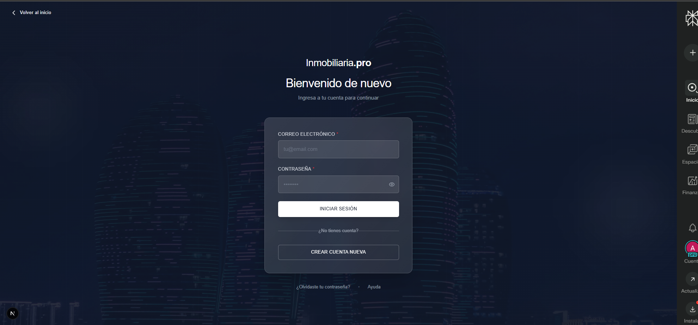
Ubicación: http://localhost:3000/auth/login
```

**🖼️ SCREENSHOT 3: Login con error de validación**

```
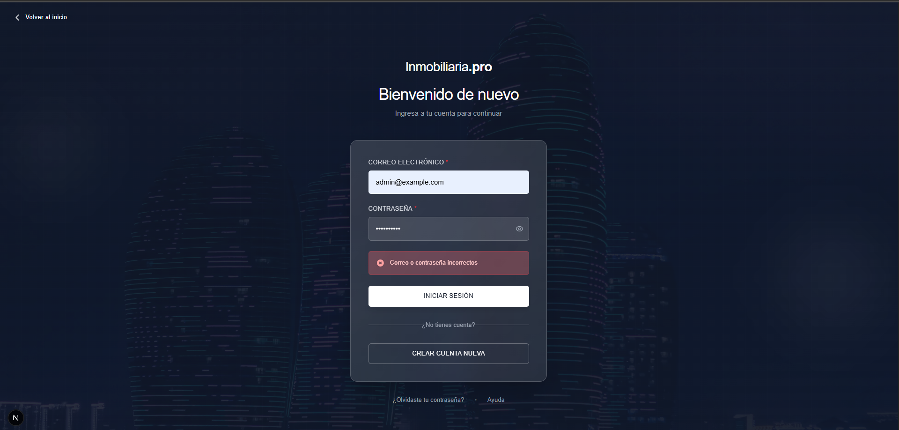
```

#### **6.1.3 Página de Registro**

Formulario de registro de nuevos usuarios.

**Características:**

- ✅ Validación de todos los campos
- ✅ Confirmación de contraseña
- ✅ Registro automático y login
- ✅ Link a login si ya tiene cuenta

**Campos del formulario:**

- Nombre completo (requerido)
- Email (requerido, formato email)
- Password (requerido, mínimo 6 caracteres)
- Confirmar password (debe coincidir)

**🖼️ SCREENSHOT 4: Página de Registro**

```
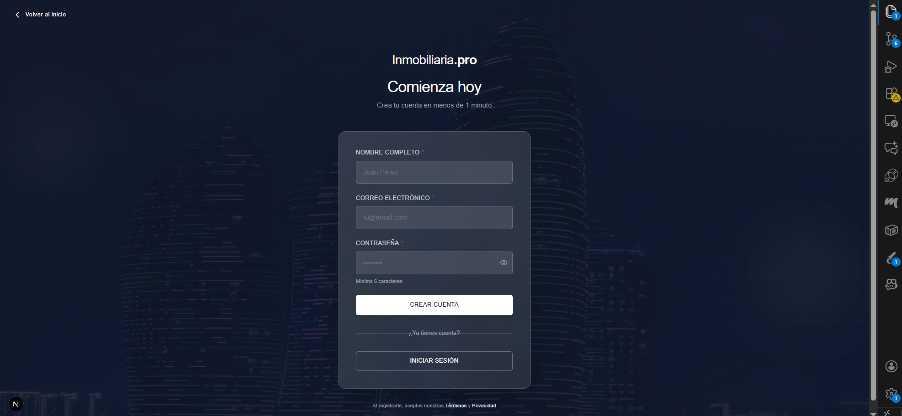
Ubicación: http://localhost:3000/auth/register
```

#### **6.1.4 Logout**

Funcionalidad de cierre de sesión desde cualquier página protegida.

**Características:**

- ✅ Botón en Navbar
- ✅ Limpieza de token y datos de usuario
- ✅ Redirección a login
- ✅ Confirmación visual

---

### 6.2 Módulo de Perfil

#### **6.2.1 Ver Perfil**

Página que muestra la información del usuario actual.

**Características:**

- ✅ Muestra nombre, email y rol
- ✅ Card con diseño profesional
- ✅ Breadcrumbs de navegación
- ✅ Botones para editar y eliminar cuenta

**Información mostrada:**

- Nombre completo
- Email
- Rol (agent o superadmin)
- Fecha de creación (si disponible)

**🖼️ SCREENSHOT 5: Página de Perfil**

```
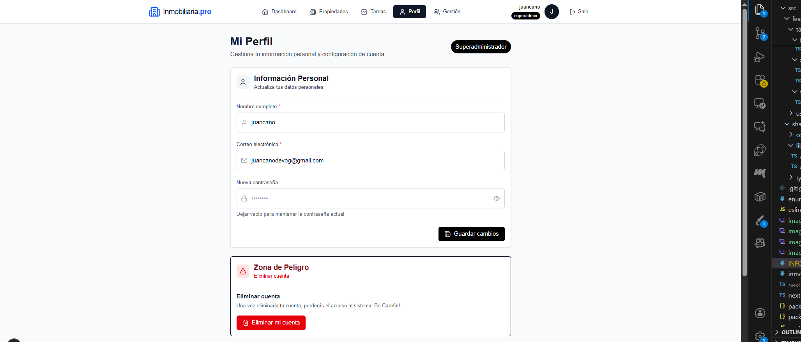
Ubicación: http://localhost:3000/profile
```

#### **6.2.2 Editar Perfil**

Formulario para actualizar información personal.

**Características:**

- ✅ Campos precargados con datos actuales
- ✅ Validación de email único
- ✅ Cambio opcional de contraseña
- ✅ Confirmación antes de guardar
- ✅ Actualización automática del contexto

**Campos editables:**

- Nombre
- Email
- Password (opcional)
- Confirmar password (si cambia contraseña)

#### **6.2.3 Eliminar Cuenta**

Opción para que el usuario elimine su propia cuenta.

**Características:**

- ✅ Confirmación antes de eliminar
- ✅ Mensaje de advertencia
- ✅ Cierre de sesión automático
- ✅ Redirección a landing page

---

### 6.3 Módulo de Usuarios (Solo Superadmin)

#### **6.3.1 Lista de Usuarios**

Tabla con todos los usuarios del sistema.

**Características:**

- ✅ Tabla responsive con columnas: Nombre, Email, Rol
- ✅ Botones de acción: Ver, Editar, Eliminar
- ✅ Indicador visual de rol con badges
- ✅ Estados de carga y error
- ✅ Estado vacío con mensaje motivacional
- ✅ Botón para crear nuevo usuario
- ✅ Hero section con estadísticas

**Columnas de la tabla:**

- Nombre
- Email
- Rol (badge con color)
- Acciones (Ver, Editar, Eliminar)

**🖼️ SCREENSHOT 6: Lista de Usuarios**

```
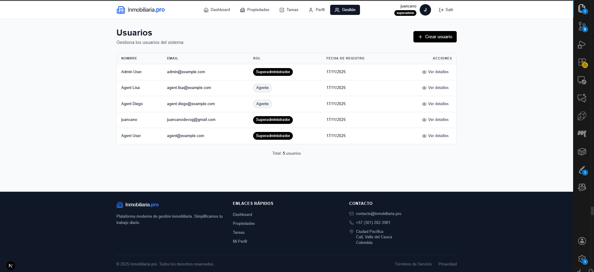
Ubicación: http://localhost:3000/users
```

```

#### **6.3.2 Crear Usuario**

Formulario para que el superadmin cree nuevos usuarios.

**Características:**

- ✅ Selector de rol (agent o superadmin)
- ✅ Validación de email único
- ✅ Generación de contraseña temporal o manual
- ✅ Hero section con breadcrumbs
- ✅ Card con diseño profesional
- ✅ Tips de ayuda al final

**Campos del formulario:**

- Nombre (requerido)
- Email (requerido, único)
- Password (requerido)
- Rol (requerido: agent o superadmin)

**🖼️ SCREENSHOT 7: Crear Usuario**

```

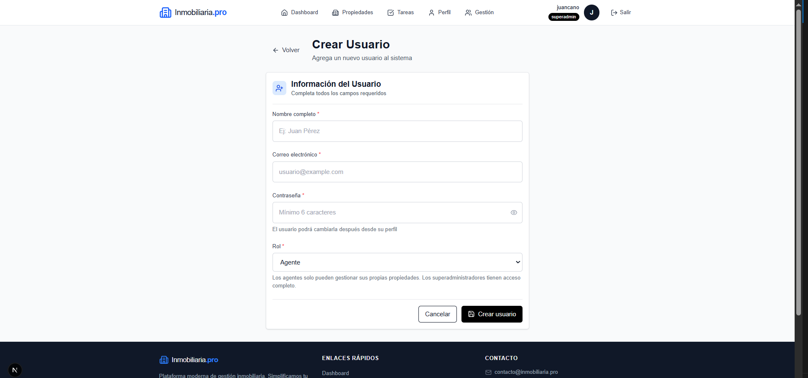
Ubicación: <http://localhost:3000/users/create>

```

#### **6.3.3 Editar Usuario**

Formulario para modificar datos de usuarios existentes.

**Características:**

- ✅ Campos precargados con datos actuales
- ✅ Puede cambiar rol
- ✅ Cambio opcional de contraseña
- ✅ Validación de email único
- ✅ No puede editar su propio rol (prevención)

**Campos editables:**

- Nombre
- Email
- Rol
- Password (opcional)

**🖼️ SCREENSHOT 8: Editar Usuario**

```

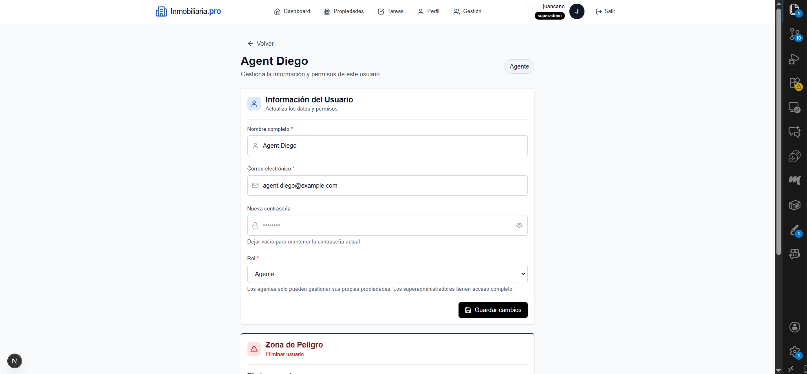
Ubicación: <http://localhost:3000/users/[id>]

```

#### **6.3.4 Eliminar Usuario**

Confirmación antes de eliminar un usuario.

**Características:**

- ✅ Modal de confirmación elegante
- ✅ Mensaje de advertencia claro
- ✅ Botones Cancelar / Eliminar
- ✅ No puede eliminarse a sí mismo
- ✅ Refetch automático tras eliminar

**🖼️ SCREENSHOT 9: Confirmación de Eliminación**

```

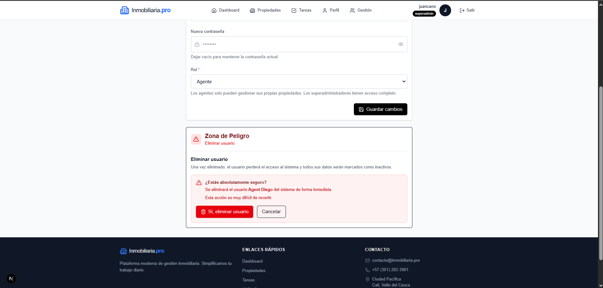

```

---

### 6.4 Módulo de Propiedades

#### **6.4.1 Catálogo Público**

Lista de propiedades visible sin autenticación.

**Características:**

- ✅ Cards con información resumida
- ✅ Imágenes placeholder
- ✅ Precio destacado
- ✅ Ubicación y características (habitaciones, baños, área)
- ✅ Botón "Ver detalles"
- ✅ Diseño en grid responsive
- ✅ Hero section atractivo

**Información por propiedad:**

- Título
- Precio (formato moneda)
- Ubicación
- Habitaciones
- Baños
- Área (m²)

**🖼️ SCREENSHOT 10: Catálogo Público**

```

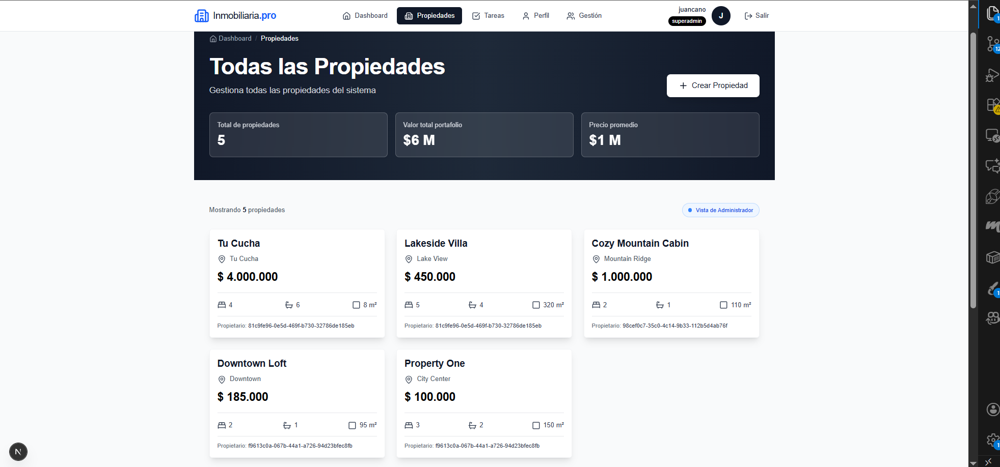
Ubicación: <http://localhost:3000/catalog>

```

#### **6.4.2 Detalle Público de Propiedad**

Vista detallada de una propiedad individual.

**Características:**

- ✅ Galería de imágenes (placeholder)
- ✅ Descripción completa
- ✅ Especificaciones técnicas
- ✅ Información de contacto
- ✅ Breadcrumbs de navegación
- ✅ Botón para volver al catálogo

**Información mostrada:**

- Título completo
- Precio
- Descripción detallada
- Ubicación exacta
- Habitaciones, baños, área
- Agente encargado (si disponible)

**🖼️ SCREENSHOT 11: Detalle de Propiedad**

```

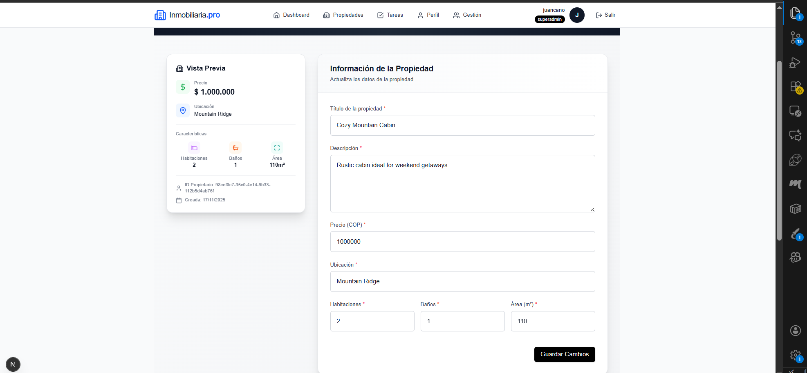
Ubicación: <http://localhost:3000/catalog/[id>]

```

#### **6.4.3 Lista de Propiedades (Protegida)**

Vista de propiedades según rol del usuario.

**Características:**

- ✅ Agent: Solo ve sus propias propiedades
- ✅ Superadmin: Ve todas las propiedades
- ✅ Tabla o cards con botones de acción
- ✅ Filtrado automático por rol
- ✅ Indicador de owner
- ✅ Estadísticas en hero section

**Para Agent:**

- Solo propiedades donde `ownerId === user.id`
- Puede editar/eliminar solo las suyas

**Para Superadmin:**

- Todas las propiedades del sistema
- Puede editar/eliminar cualquiera
- Selector de agente al crear

**🖼️ SCREENSHOT 12: Lista de Propiedades (Agent)**

```

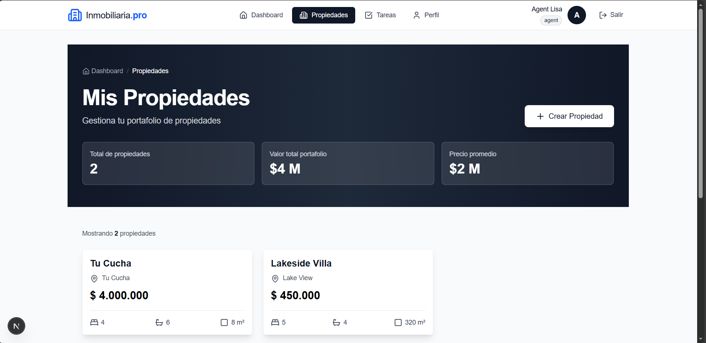
Ubicación: <http://localhost:3000/properties> (como agent)

```

**🖼️ SCREENSHOT 13: Lista de Propiedades (Superadmin)**

```


Ubicación: <http://localhost:3000/properties> (como superadmin)

```

#### **6.4.4 Crear Propiedad**

Formulario para agregar nuevas propiedades.

**Características:**

- ✅ Validación de todos los campos
- ✅ Números solo positivos
- ✅ Precio con formato de moneda
- ✅ Área en metros cuadrados
- ✅ Agent: ownerId asignado automáticamente
- ✅ Superadmin: selector de agente (ownerId manual)
- ✅ Hero section con breadcrumbs
- ✅ Tips de ayuda

**Campos del formulario:**

- Título (requerido, máx 120 caracteres)
- Descripción (requerida)
- Precio (requerido, número positivo)
- Ubicación (requerida)
- Habitaciones (requerido, número entero)
- Baños (requerido, número entero)
- Área en m² (requerido, número positivo)
- Owner (solo superadmin, selector de agente)

**🖼️ SCREENSHOT 14: Crear Propiedad (Agent)**

```

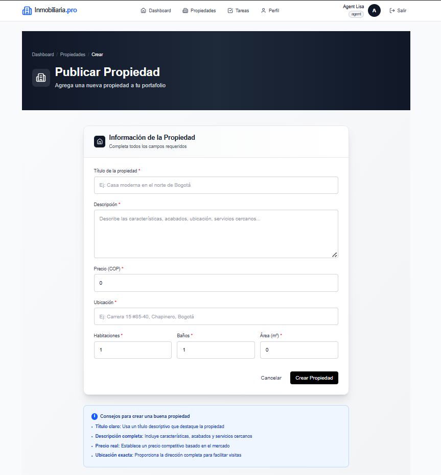
Ubicación: <http://localhost:3000/properties/create> (como agent)

```

**🖼️ SCREENSHOT 15: Crear Propiedad (Superadmin)**

```

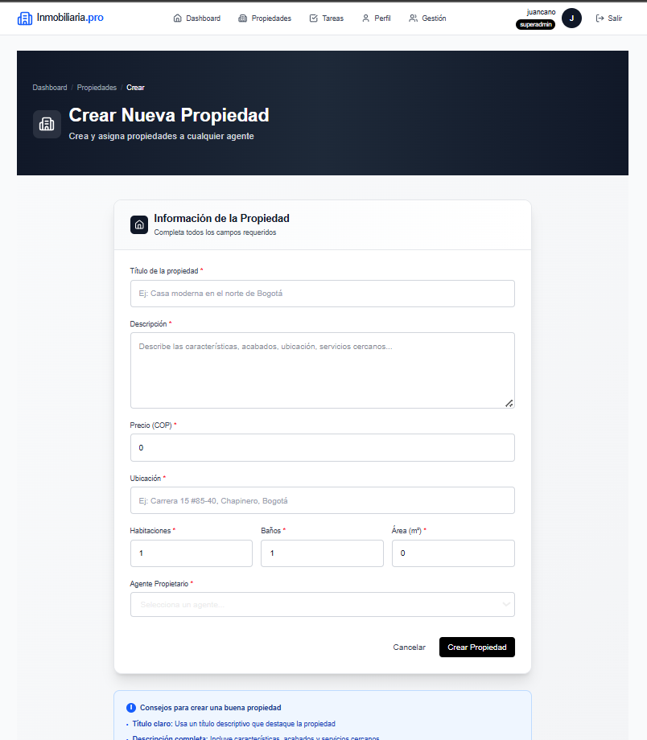
Ubicación: <http://localhost:3000/properties/create> (como superadmin)

```

#### **6.4.5 Editar Propiedad**

Formulario para modificar propiedades existentes.

**Características:**

- ✅ Campos precargados con datos actuales
- ✅ Solo owner o superadmin puede editar
- ✅ Validación de ownership
- ✅ No puede cambiar owner (readonly)
- ✅ Breadcrumbs con título de propiedad

**Validaciones:**

- Agent: Solo si `property.ownerId === user.id`
- Superadmin: Cualquier propiedad
- Error 403 si no tiene permisos

**🖼️ SCREENSHOT 16: Editar Propiedad**

```

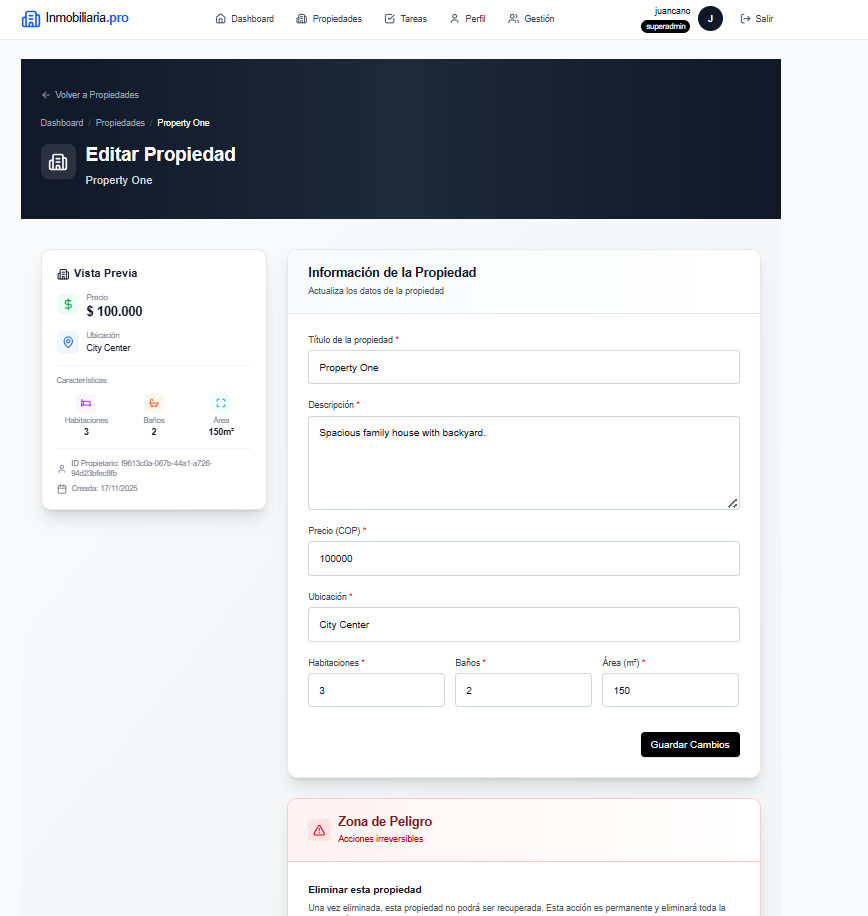
Ubicación: <http://localhost:3000/properties/[id>]

```

#### **6.4.6 Eliminar Propiedad**

Confirmación antes de eliminar una propiedad.

**Características:**

- ✅ Modal de confirmación
- ✅ Validación de ownership
- ✅ Solo owner o superadmin
- ✅ Refetch automático tras eliminar

**🖼️ SCREENSHOT 17: Confirmar Eliminación de Propiedad**

```

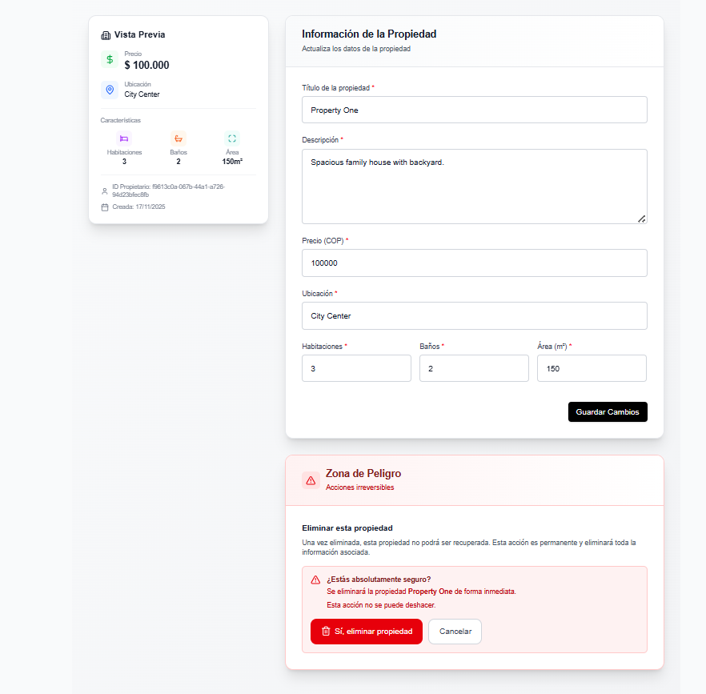

```

---

### 6.5 Módulo de Tareas

#### **6.5.1 Lista de Tareas**

Vista de tareas según rol del usuario.

**Características:**

- ✅ Agent: Solo tareas asignadas a él (`assignedToId === user.id`)
- ✅ Superadmin: Todas las tareas del sistema
- ✅ Cards con badges de estado (completado/pendiente)
- ✅ Toggle rápido de estado completado
- ✅ Emojis para visual enhancement (📅 🏠 👤)
- ✅ Indicador de fecha de vencimiento
- ✅ Breadcrumbs y hero section
- ✅ Estados de carga y error

**Información por tarea:**

- Título
- Descripción (si existe)
- Estado (completado ✅ / pendiente ⏳)
- Fecha de vencimiento
- Propiedad relacionada
- Agente asignado (si existe)

**🖼️ SCREENSHOT 18: Lista de Tareas (Agent)**

```

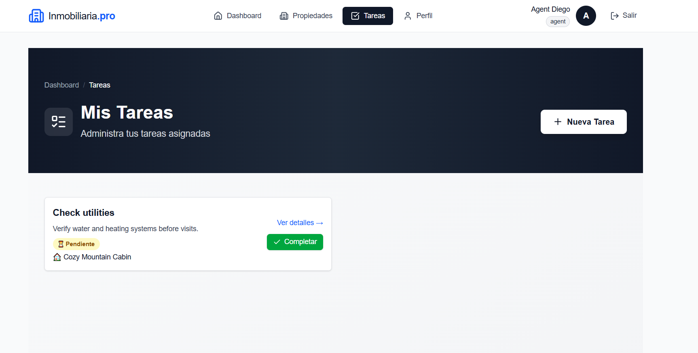
Ubicación: <http://localhost:3000/dashboard/tasks> (como agent)

```

**🖼️ SCREENSHOT 19: Lista de Tareas (Superadmin)**

```

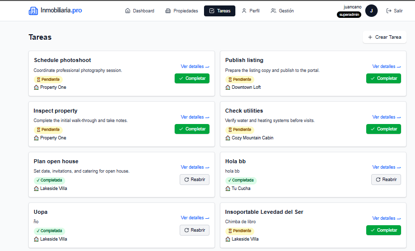
Ubicación: <http://localhost:3000/dashboard/tasks> (como superadmin)

```

**🖼️ SCREENSHOT 20: Toggle de Estado**

```

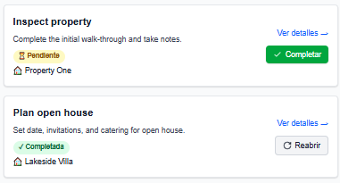

```

#### **6.5.2 Crear Tarea**

Formulario para agregar nuevas tareas.

**Características:**

- ✅ Validación de título requerido
- ✅ Selector de propiedad (requerido)
- ✅ Fecha de vencimiento (no permite fechas pasadas)
- ✅ Validación en HTML input (min=today)
- ✅ Descripción opcional
- ✅ **Auto-asignación de agente:**
  - Cuando superadmin selecciona una propiedad
  - Automáticamente asigna al agente dueño (`property.ownerId`)
  - Campo de agente se deshabilita
  - Mensaje informativo
- ✅ Agent: Solo puede crear para sus propiedades
- ✅ Hero section con breadcrumbs
- ✅ Tips de ayuda al final

**Campos del formulario:**

- Título (requerido)
- Descripción (opcional)
- Fecha de vencimiento (opcional, no pasada)
- Propiedad (requerido)
- Asignar a (solo superadmin, auto-asignado)

**🖼️ SCREENSHOT 21: Crear Tarea (Agent)**

```

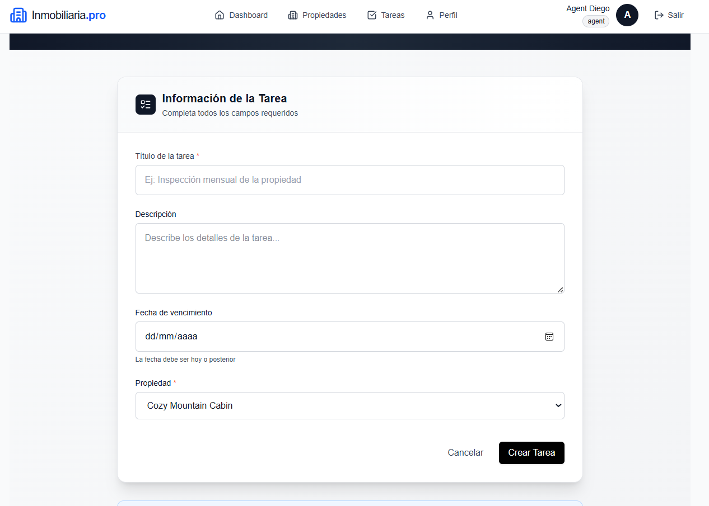
Ubicación: <http://localhost:3000/dashboard/tasks/create> (como agent)

```

**🖼️ SCREENSHOT 22: Crear Tarea (Superadmin) - Auto-asignación**

```

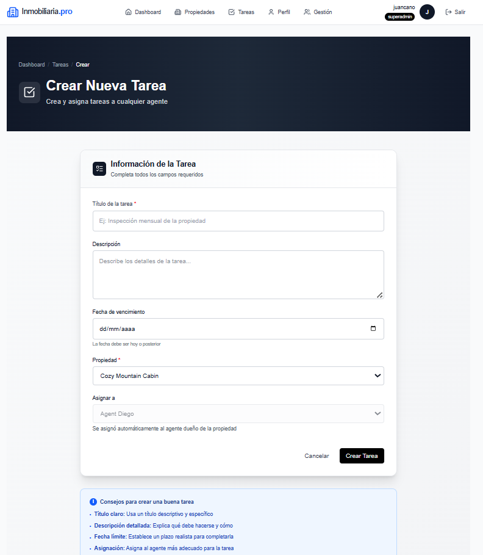
Ubicación: <http://localhost:3000/dashboard/tasks/create> (como superadmin)
Mostrar: Selector de propiedad + campo agente deshabilitado + mensaje "Se asignó automáticamente al agente dueño de la propiedad"

```

**🖼️ SCREENSHOT 23: Validación de Fecha Pasada**

```

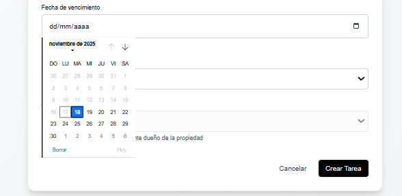

```

#### **6.5.3 Editar Tarea**

Formulario para modificar tareas existentes.

**Características:**

- ✅ Campos precargados con datos actuales
- ✅ Fecha formateada correctamente (ISO → YYYY-MM-DD)
- ✅ Propiedad no se puede cambiar (readonly con mensaje)
- ✅ Checkbox para marcar como completada
- ✅ Agent: Solo si está asignada a él
- ✅ Superadmin: Cualquier tarea
- ✅ Validación de ownership
- ✅ Breadcrumbs con "Editar"

**Validaciones:**

- Agent: Solo si `task.assignedToId === user.id`
- Superadmin: Cualquier tarea
- Error si no tiene permisos

**🖼️ SCREENSHOT 24: Editar Tarea**

```

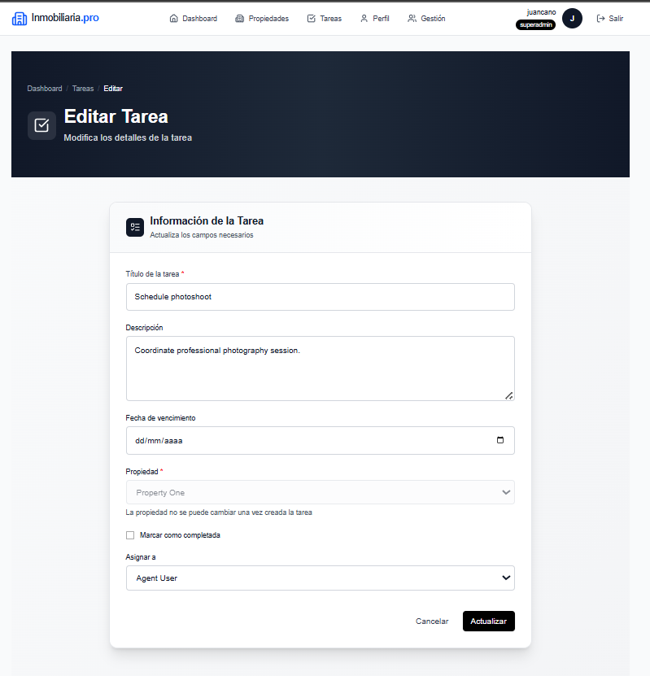
Ubicación: <http://localhost:3000/dashboard/tasks/[id>]
Mostrar: Campo de fecha con valor correcto, checkbox de completado, propiedad readonly

```

**🖼️ SCREENSHOT 25: Checkbox "Marcar como completada"**

```

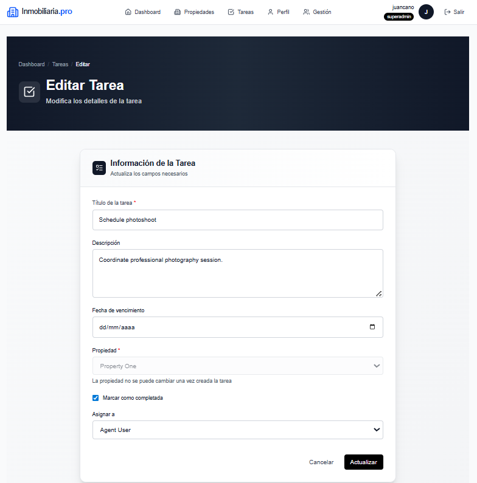

```

---

### 6.6 Dashboard Principal

Vista principal tras iniciar sesión.

**Características:**

- ✅ Bienvenida personalizada con nombre del usuario
- ✅ Resumen de propiedades (agent: suyas, admin: todas)
- ✅ Resumen de tareas pendientes
- ✅ Enlaces rápidos a secciones principales
- ✅ Diseño diferente según rol:
  - Agent: Foco en sus propiedades y tareas
  - Superadmin: Estadísticas globales + acceso a gestión de usuarios

**Secciones del Dashboard:**

- Hero con saludo y rol
- Estadísticas principales (cards con números)
- Accesos rápidos (botones a crear propiedad, crear tarea, etc.)
- Lista resumida de tareas pendientes

**🖼️ SCREENSHOT 26: Dashboard (Agent)**

```

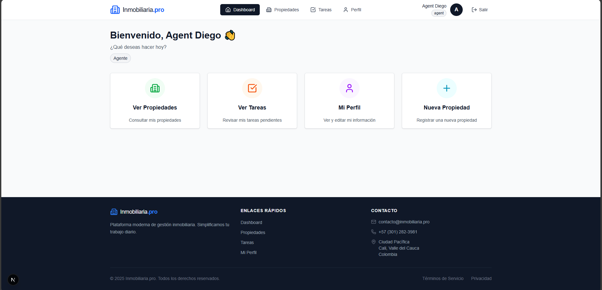
Ubicación: <http://localhost:3000/dashboard> (como agent)

```

**🖼️ SCREENSHOT 27: Dashboard (Superadmin)**

```

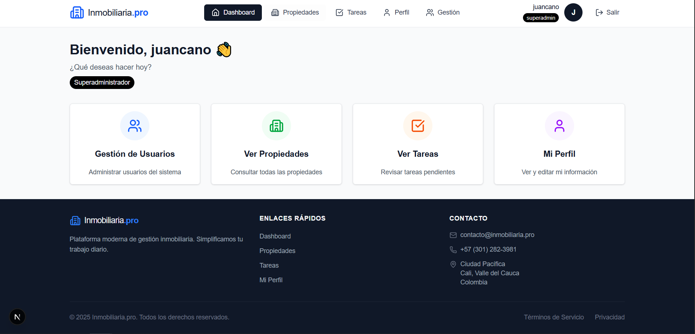
Ubicación: <http://localhost:3000/dashboard> (como superadmin)

```

---

### 6.7 Componentes UI Reutilizables

#### **6.7.1 Button**

Componente de botón con variantes.

**Variantes:**

- `primary`: Fondo oscuro (default)
- `secondary`: Fondo blanco con borde
- `danger`: Rojo para acciones destructivas
- `ghost`: Transparente

**Props:**

- `isLoading`: Muestra spinner
- `disabled`: Deshabilita interacción
- `onClick`: Manejador de evento
- `type`: submit | button | reset


```

#### **6.7.2 Input**

Componente de input con label y validaciones.

**Características:**

- ✅ Label integrado
- ✅ Tipos: text, email, password, number, date
- ✅ Estados: normal, error, disabled
- ✅ Placeholder
- ✅ Required indicator

#### **6.7.3 Card**

Contenedor con sombra y bordes redondeados.

#### **6.7.4 Table**

Tabla responsive con estilos consistentes.

#### **6.7.5 Badge**

Indicadores de estado o rol con colores.

**Variantes:**

- Verde: Completado, Superadmin
- Amarillo: Pendiente
- Azul: Agent
- Gris: Inactivo

---

### 6.8 Navbar y Footer

#### **6.8.1 Navbar**

Barra de navegación adaptativa según rol y estado de autenticación.

**Características:**

- ✅ Logo con link a home
- ✅ Enlaces según rol:
  - Público: Catálogo, Login, Register
  - Agent: Dashboard, Propiedades, Tareas, Perfil, Logout
  - Superadmin: Dashboard, Usuarios, Propiedades, Tareas, Perfil, Logout
- ✅ Indicador de usuario actual
- ✅ Menú hamburguesa en móvil
- ✅ Responsive completo

#### **6.8.2 Footer**

Pie de página con información adicional.

**Contenido:**

- Copyright
- Enlaces útiles
- Información de contacto

**🖼️ SCREENSHOT 28: Footer**

```
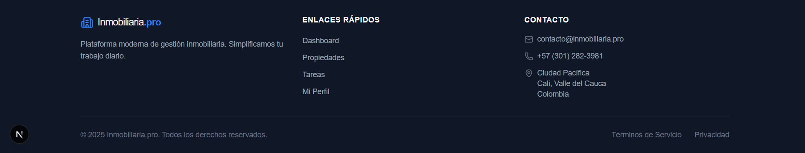

```

---

### 6.9 Estados de la Aplicación

#### **6.9.1 Estados de Carga**

**Características:**

- ✅ Spinners animados
- ✅ Mensajes descriptivos ("Cargando usuarios...", "Guardando...")
- ✅ Skeleton loaders en algunas vistas

#### **6.9.2 Estados Vacíos**

**Características:**

- ✅ Mensajes motivacionales
- ✅ Ilustraciones o íconos
- ✅ Botón CTA para crear el primer elemento

**Ejemplos:**

- "Aún no tienes propiedades. ¡Crea tu primera propiedad ahora!"
- "No hay tareas pendientes. ¡Todo al día! 🎉"

#### **6.9.3 Estados de Error**

**Características:**

- ✅ Mensajes claros sin código técnico
- ✅ Íconos de alerta
- ✅ Color rojo para destacar
- ✅ Sugerencias de solución

**Ejemplos:**

- "Error al cargar propiedades. Intenta recargar la página."
- "No tienes permisos para eliminar esta propiedad."
- "Credenciales inválidas. Verifica tu email y contraseña."

---

## 7. Decisiones Técnicas

### 7.1 ¿Por qué Next.js App Router?

**Ventajas sobre Pages Router:**

| Aspecto           | App Router       | Pages Router      |
| ----------------- | ---------------- | ----------------- |
| Server Components | ✅ Por defecto   | ❌ No             |
| Layouts anidados  | ✅ Sí            | ❌ Complejo       |
| Loading states    | ✅ `loading.tsx` | ❌ Manual         |
| Error boundaries  | ✅ `error.tsx`   | ❌ Manual         |
| Rutas protegidas  | ✅ Layouts       | ❌ HOCs complejos |
| Performance       | ✅ Mejor         | ⚠️ Buena          |
| Futuro            | ✅ Recomendado   | ⚠️ Legacy         |

**Decisión:** App Router porque es el futuro de Next.js y simplifica muchas tareas comunes.

### 7.2 ¿Por qué TypeScript?

**Ventajas:**

- ✅ **Detección temprana de errores:** Compilador atrapa errores antes de runtime
- ✅ **Autocompletado mejorado:** IntelliSense en IDEs
- ✅ **Documentación viva:** Los tipos sirven como documentación
- ✅ **Refactoring seguro:** Cambios sin romper código
- ✅ **Contratos con backend:** DTOs tipados garantizan consistencia

**Ejemplo de beneficio:**

```typescript
// Sin TypeScript
const user = response.user;
console.log(user.namee); // Error en runtime (typo)

// Con TypeScript
const user: User = response.user;
console.log(user.namee); // ❌ Error en compile time
```

### 7.3 ¿Por qué Feature-Based Architecture?

**Alternativas consideradas:**

1. **Layer-Based** (components/, services/, hooks/)

   - ❌ Difícil encontrar código relacionado
   - ❌ Archivos muy dispersos

2. **Flat Structure** (todo en src/)

   - ❌ No escala con el crecimiento
   - ❌ Difícil de mantener

3. **Feature-Based** (features/users/, features/properties/)
   - ✅ Todo relacionado junto
   - ✅ Fácil agregar nuevos módulos
   - ✅ Claro dónde va cada archivo
   - ✅ Mejor para equipos grandes

**Decisión:** Feature-Based porque facilita el mantenimiento y escalabilidad.

### 7.4 ¿Por qué Custom Hooks?

**Ventajas:**

- ✅ **Reutilización de lógica:** Mismo hook en múltiples componentes
- ✅ **Componentes más limpios:** Lógica encapsulada
- ✅ **Testing más fácil:** Hooks se pueden testear aisladamente
- ✅ **Separación de responsabilidades:** UI vs Lógica

**Ejemplo de impacto:**

```typescript
// Sin hook - Código duplicado en cada componente
function PropertiesPage() {
  const [properties, setProperties] = useState([]);
  const [isLoading, setIsLoading] = useState(true);

  useEffect(() => {
    fetch("/api/properties")
      .then((res) => res.json())
      .then((data) => setProperties(data))
      .finally(() => setIsLoading(false));
  }, []);

  // ... más código
}

// Con hook - Reutilizable y limpio
function PropertiesPage() {
  const { properties, isLoading } = useProperties();

  // Componente enfocado solo en UI
}
```

### 7.5 ¿Por qué Tailwind CSS?

**Alternativas consideradas:**

| Aspecto     | Tailwind         | CSS Modules    | Styled Components |
| ----------- | ---------------- | -------------- | ----------------- |
| Bundle size | ✅ Solo lo usado | ⚠️ Todo el CSS | ❌ Runtime CSS    |
| Performance | ✅ Excelente     | ✅ Buena       | ⚠️ Regular        |
| DX          | ✅ Rápido        | ⚠️ Verboso     | ⚠️ Verboso        |
| Responsive  | ✅ Integrado     | ❌ Manual      | ❌ Manual         |
| Purge       | ✅ Automático    | ❌ Manual      | ✅ Automático     |

**Decisión:** Tailwind CSS por velocidad de desarrollo, bundle optimizado y responsive integrado.

### 7.6 ¿Por qué No Usar Paginación?

**Razón:** El backend NestJS no implementa paginación en los endpoints.

**Respuestas del backend:**

```typescript
// Todos los endpoints retornan arrays completos
{
  "users": [...], // Todos los usuarios
  "total": 25
}
```

**Decisión:** No implementar paginación en frontend porque:

- ❌ Backend no la soporta (tendría que cachear todo)
- ❌ Agregar paginación falsa no tiene valor
- ✅ Para la cantidad de datos esperada, no es crítico

**Futuro:** Si el backend agrega paginación, el frontend la implementará fácilmente en los services.

### 7.7 ¿Por qué No Usar window.alert()?

**Problemas de window.alert():**

- ❌ Bloquea la UI completamente
- ❌ Apariencia no personalizable
- ❌ Mala experiencia de usuario
- ❌ No es accesible (ARIA)

**Solución implementada:**

```typescript
// En lugar de
window.alert("Error al guardar");

// Usamos componentes elegantes
<div className="bg-red-50 border border-red-200 rounded-xl p-4">
  <AlertCircle className="w-5 h-5 text-red-600" />
  <p className="text-red-700">Error al guardar. Intenta nuevamente.</p>
</div>;
```

**Ventajas:**

- ✅ No bloquea la UI
- ✅ Estilo consistente con la app
- ✅ Puede incluir botones de acción
- ✅ Mejor accesibilidad

### 7.8 ¿Por qué localStorage para Tokens?

**Alternativas:**

| Método           | Ventajas                        | Desventajas                                         |
| ---------------- | ------------------------------- | --------------------------------------------------- |
| localStorage     | ✅ Fácil de usar<br>✅ Persiste | ⚠️ Vulnerable a XSS                                 |
| sessionStorage   | ✅ Se limpia al cerrar          | ❌ No persiste                                      |
| Cookies httpOnly | ✅ Seguro contra XSS            | ❌ Complejo con Next.js<br>❌ Backend no lo soporta |
| Memory           | ✅ Muy seguro                   | ❌ Se pierde al refrescar                           |

**Decisión:** localStorage porque:

- ✅ Backend no soporta httpOnly cookies
- ✅ Persistencia es importante para UX
- ✅ Riesgo de XSS mitigado con buenas prácticas
- ✅ Tokens tienen expiración en backend

**Mitigaciones de seguridad:**

- Validación de inputs (prevenir XSS)
- Content Security Policy (CSP)
- Tokens con expiración corta
- HTTPS en producción

### 7.9 ¿Por qué Separar Endpoints Agent/Admin?

**Alternativa no elegida:**

```typescript
// Un solo endpoint con filtrado en frontend
GET / api / properties;

// Frontend filtra según rol
const myProperties = properties.filter((p) =>
  user.role === "agent" ? p.ownerId === user.id : true
);
```

**Problemas:**

- ❌ Expone datos sensibles al frontend
- ❌ Usuario malicioso puede ver JSON completo
- ❌ Más datos transferidos innecesariamente

**Solución elegida:**

```typescript
// Endpoints separados
GET /api/properties/agent   # Solo del agente
GET /api/properties/admin   # Todas (solo admin)
```

**Ventajas:**

- ✅ Backend controla la autorización
- ✅ Datos mínimos transferidos
- ✅ Más seguro
- ✅ Carga más rápida

### 7.10 ¿Por qué Auto-asignación de Tareas?

**Problema identificado:**

Cuando un superadmin creaba una tarea:

- Podía seleccionar cualquier propiedad
- Podía asignar a cualquier agente
- Si el agente asignado no era dueño de la propiedad, **no veía la tarea**

**Causa raíz:**

El backend filtra tareas de agentes por `property.ownerId`, no por `task.assignedToId`.

**Solución implementada:**

Auto-asignar la tarea al agente dueño de la propiedad seleccionada:

```typescript
// TaskForm.tsx
useEffect(() => {
  if (propertyId) {
    const property = properties.find((p) => p.id === propertyId);
    if (property?.ownerId) {
      setAssignedTo(property.ownerId); // Auto-asignar
    }
  }
}, [propertyId]);
```

**Resultado:**

- ✅ Consistencia: Tareas solo para agentes relevantes
- ✅ Lógica clara: Propiedad → Agente automático
- ✅ Previene errores: No hay tareas "perdidas"

---

## 8. Conclusiones

### 8.1 Logros Alcanzados

#### **Funcionalidad Completa (65% del proyecto)**

✅ **Autenticación (10%)**

- Sistema JWT completamente funcional
- Login/Register con validaciones
- Persistencia de sesión
- Redirecciones automáticas
- Manejo robusto de tokens

✅ **Autorización (10%)**

- 2 roles implementados (agent, superadmin)
- Permisos granulares por rol
- UI adaptativa según permisos
- Validación de ownership
- Endpoints diferenciados

✅ **Interfaz de Usuario (15%)**

- 20+ páginas implementadas
- Componentes UI reutilizables (5)
- CRUD completo para 3 entidades
- Validaciones sin window.alert()
- Diseño responsive y profesional
- Estados de carga/error/vacío

✅ **Gestión del Estado (10%)**

- Context API implementado
- 14+ hooks custom
- Estado centralizado
- Patrón consistente
- Refetch automático

✅ **Funcionalidades (20%)**

- Módulo de Users (CRUD completo)
- Módulo de Properties (CRUD + catálogo público)
- Módulo de Tasks (CRUD + auto-asignación)
- Dashboard dinámico
- Perfil de usuario
- Integración completa con backend

#### **Características Destacadas**

🌟 **Auto-asignación Inteligente de Tareas**

- Soluciona problema de backend
- Garantiza consistencia
- Mejor UX para superadmin

🌟 **Validación de Fechas en Tareas**

- Previene fechas pasadas
- Formateo correcto ISO → Input
- Validación HTML + JavaScript

🌟 **UI Profesional y Consistente**

- Hero sections con gradientes
- Breadcrumbs en todas las páginas
- Badges de estado con colores
- Cards con sombras y bordes redondeados
- Emojis para enhancement visual

🌟 **Arquitectura Escalable**

- Feature-based structure
- Custom hooks pattern
- Service layer
- TypeScript strict mode

### 8.2 Desafíos Enfrentados

#### **1. Sincronización Backend-Frontend**

**Problema:** Backend usa `isCompleted: boolean`, frontend inicialmente usaba `status: string`

**Solución:** Refactorización completa de tipos y servicios

**Aprendizaje:** Verificar contrato de API antes de empezar (usar Postman collection)

#### **2. Formateo de Fechas**

**Problema:** Backend envía ISO dates, input HTML espera YYYY-MM-DD

**Solución:** Helper function `formatDateForInput()`

**Aprendizaje:** Siempre transformar datos entre backend y UI

#### **3. Autorización por Ownership**

**Problema:** ¿Cómo prevenir que un agente edite propiedades de otro?

**Solución:**

- Endpoints separados agent/admin
- Validación en hooks antes de operaciones
- UI adaptativa (ocultar botones)

**Aprendizaje:** Autorización en múltiples capas (backend + frontend)

#### **4. Tareas "Perdidas"**

**Problema:** Tareas asignadas a agente X para propiedad de agente Y no aparecían

**Solución:** Auto-asignación al agente dueño de la propiedad

**Aprendizaje:** Entender el modelo de datos del backend a profundidad

#### **5. TypeScript Strict Mode**

**Problema:** Errores de tipos en compilación

**Solución:**

- DTOs completos con todos los campos
- Tipos opcionales vs required bien definidos
- Union types para respuestas diferentes

**Aprendizaje:** TypeScript estricto previene bugs, vale la pena el esfuerzo

### 8.3 Mejoras Futuras

#### **Pendiente (35% del proyecto)**

⏳ **Testing (15%)**

- Pruebas unitarias (Jest + React Testing Library)
- Pruebas E2E (Playwright o Cypress)
- Coverage mínimo 60-70%

⏳ **Despliegue (10%)**

- Deploy en Vercel/Netlify
- CI/CD con GitHub Actions
- Variables de entorno en producción
- Monitoring y logging

⏳ **Informe (10%)**

- ✅ Documentación técnica (este documento)
- ⏳ Screenshots de todas las funcionalidades
- ⏳ Video demo (opcional)

#### **Funcionalidades Extra (No Requeridas)**

💡 **Mejoras de UX:**

- Búsqueda y filtros en tablas
- Paginación (cuando backend la soporte)
- Ordenamiento de columnas
- Exportación a PDF/Excel
- Notificaciones push
- Dark mode

💡 **Mejoras de Performance:**

- React Query para cache de datos
- Suspense boundaries
- Lazy loading de rutas
- Image optimization
- Service Worker (PWA)

💡 **Mejoras de Seguridad:**

- Rate limiting en frontend
- CAPTCHA en registro
- 2FA (Two-Factor Authentication)
- Audit logs
- Password strength meter

💡 **Mejoras de Features:**

- Comentarios en propiedades
- Sistema de favoritos
- Comparador de propiedades
- Mapa interactivo de ubicaciones
- Calendario de tareas
- Recordatorios por email

### 8.4 Aprendizajes del Proyecto

#### **Técnicos:**

1. **Next.js App Router es poderoso pero requiere cambio de mentalidad**

   - Server Components por defecto
   - Layouts anidados simplifican mucho
   - `loading.tsx` y `error.tsx` son muy útiles

2. **TypeScript es inversión que paga dividendos**

   - Menos bugs en runtime
   - Refactoring seguro
   - Documentación viva

3. **Feature-based architecture escala muy bien**

   - Fácil encontrar código
   - Fácil agregar nuevos módulos
   - Mejor para trabajo en equipo

4. **Custom hooks son la clave para código limpio**

   - Reutilización de lógica
   - Testing más fácil
   - Componentes más simples

5. **Context API es suficiente para apps medianas**
   - Menos boilerplate que Redux
   - Más fácil de entender
   - Performance adecuada

#### **De Proceso:**

1. **Importancia de revisar contrato de API primero**

   - Evita refactorizaciones costosas
   - Alinea expectativas temprano
   - Postman collections son oro

2. **Iteración rápida > Planificación excesiva**

   - Implementar, probar, ajustar
   - Feedback temprano es valioso
   - No optimizar prematuramente

3. **UI consistente requiere disciplina**

   - Componentes reutilizables desde el inicio
   - Design system simple pero efectivo
   - Tailwind ayuda mucho con esto

4. **Documentación incremental es mejor que al final**
   - Comentar código al escribirlo
   - README actualizado constantemente
   - Este informe hecho durante desarrollo

#### **De Trabajo en Equipo:**

1. **Comunicación clara sobre estructura**

   - Todos deben entender la arquitectura
   - Patrones consistentes facilitan colaboración
   - Code reviews son esenciales

2. **División por features funciona muy bien**

   - Cada dev puede trabajar en un módulo
   - Menos conflictos de merge
   - Progreso paralelo

3. **TypeScript ayuda al onboarding**
   - Nuevos devs entienden código más rápido
   - Menos preguntas "¿qué tipo es esto?"
   - IntelliSense es maestro silencioso

### 8.5 Reflexión Final

Este proyecto ha sido una experiencia completa de desarrollo frontend moderno. Hemos implementado:

- ✅ Un sistema de autenticación robusto y seguro
- ✅ Control de acceso granular basado en roles
- ✅ Una interfaz de usuario profesional y responsive
- ✅ Gestión de estado eficiente y escalable
- ✅ Integración completa con un backend REST
- ✅ Validaciones exhaustivas y manejo de errores
- ✅ Una arquitectura limpia y mantenible

**Lo más valioso no es solo el código, sino los patrones y prácticas aprendidas:**

- Cómo estructurar una aplicación React/Next.js grande
- Cómo manejar autenticación y autorización correctamente
- Cómo crear una UI consistente y accesible
- Cómo gestionar estado de forma escalable
- Cómo trabajar con TypeScript efectivamente
- Cómo integrar frontend y backend sin problemas

**El resultado es una aplicación funcional, profesional y lista para ser extendida** con testing, despliegue y las mejoras adicionales mencionadas.

---

## 📚 Referencias y Recursos

### Documentación Oficial

- [Next.js Documentation](https://nextjs.org/docs)
- [React Documentation](https://react.dev)
- [TypeScript Handbook](https://www.typescriptlang.org/docs/)
- [Tailwind CSS](https://tailwindcss.com/docs)

### Guías y Tutoriales

- [Next.js App Router Tutorial](https://nextjs.org/docs/app)
- [React Hooks Guide](https://react.dev/reference/react)
- [TypeScript with React](https://react-typescript-cheatsheet.netlify.app/)

### Herramientas

- [VS Code](https://code.visualstudio.com/)
- [Postman](https://www.postman.com/)
- [Git](https://git-scm.com/)

---

**Fin del Informe**

_Documento generado para el curso de Computación en Internet III_  
_Noviembre 2025_
